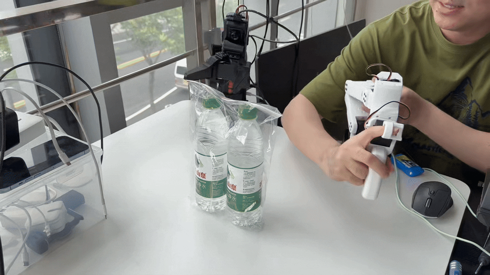

# AM-ARM200

[](https://discord.gg/CacMUBaFgJ) [](https://x.com/liyitengx)

AM-ARM200 extends the SO-ARM100 design philosophy — an open-source 6+1DoF robotic arm with 1 kg payload, fully 3D-printable and built for embodied AI research. ~$240 follower / ~$140 leader / ~$380 full teleoperation kit.

> Looking for the complete AlohaMini robot? See the [AlohaMini repository](https://github.com/liyiteng/alohamini).

## Updates

- **[2026-05-29]** URDF files coming soon

### What Makes It Different

- **6+1 DoF with 1 kg payload** — more capable than most low-cost arms at this price point
- **Long reach** — designed to cover real table-top manipulation distances
- **LeRobot & AlohaMini compatible** — works out of the box with the most popular open-source robot learning stack
- **Fully 3D-printable** — print and assemble at home in ~60 minutes
- **Low cost** — full teleoperation kit under $380

## Gallery



## Bill of Materials

### AM-ARM200 Follower

| Item | Qty | Unit (USD) | Subtotal (USD) |
|---|---:|---:|---:|
| Feetech STS3215 servo (12V, 1/345) | 4 | $16 | $64 |
| Feetech STS3095 servo (12V, 1/399) | 3 | $50 | $150 |
| Waveshare bus servo controller | 1 | $5 | $5 |
| 12V 4A power supply | 1 | $14 | $14 |
| Bearings, fasteners, cables | — | — | ~$10 |
| 3D-printed parts | — | — | self-print |
| **Total** | | | **~$243** |

### AM-ARM200 Leader

| Item | Qty | Unit (USD) | Subtotal (USD) |
|---|---:|---:|---:|
| Feetech STS3215 servo (5V, 1/147) | 7 | $16 | $112 |
| Waveshare bus servo controller | 1 | $5 | $5 |
| 5V 4A power supply | 1 | $10 | $10 |
| Bearings, fasteners, cables | — | — | ~$10 |
| 3D-printed parts | — | — | self-print |
| **Total** | | | **~$137** |


## Getting Started

### 1. Buy components

Order servos, controller, power supply, and small parts. See [BOM](am-arm200/bom.md).

### 2. Print parts

~20 hours on a standard FDM printer. See [3D printing guide](am-arm200/3d-print.md).

### 3. Assemble

Build a leader + follower pair in ~60 minutes. See [assembly guide](am-arm200/hardware_assembly.md).

### 4. Software setup

All software steps are in the **[lerobot_alohamini](https://github.com/liyiteng/lerobot_alohamini)** shared software repository. Follow the steps below in order — each links directly to the relevant section.

| Step | What | Where |
|------|------|--------|
| 1 | Install environment | [install.md](https://github.com/liyiteng/lerobot_alohamini/blob/main/docs/alohamini/install.md) |
| 2 | Find arm ports | [§1 Port Configuration](https://github.com/liyiteng/lerobot_alohamini/blob/main/docs/alohamini/am-arm200.md#1-port-configuration) |
| 3 | Calibrate arms & teleoperate | [§3 Calibration](https://github.com/liyiteng/lerobot_alohamini/blob/main/docs/alohamini/am-arm200.md#3-calibration) |
| 4 | Record a dataset | [§5 Dataset Recording](https://github.com/liyiteng/lerobot_alohamini/blob/main/docs/alohamini/am-arm200.md#5-dataset-recording) |
| 5 | Train a policy | [§8 Training](https://github.com/liyiteng/lerobot_alohamini/blob/main/docs/alohamini/am-arm200.md#8-training) |
| 6 | Evaluate the policy | [§9 Evaluation](https://github.com/liyiteng/lerobot_alohamini/blob/main/docs/alohamini/am-arm200.md#9-evaluation) |

<details>
<summary><strong>Advanced: patch upstream LeRobot instead of using lerobot_alohamini</strong></summary>

If you already have a working LeRobot environment and prefer to stay on the upstream repo, you can add STS3095 support manually with two changes.

**Step 1 — Register STS3095 in the motor table**

In `lerobot/src/lerobot/motors/feetech/tables.py`, add `"sts3095"` to each of the five model dictionaries. STS3095 is STS-series (same protocol as STS3215), so the values mirror that motor:

```python
MODEL_CONTROL_TABLE = {
    ...
    "sts3095": STS_SMS_SERIES_CONTROL_TABLE,   # add this
}

MODEL_RESOLUTION = {
    ...
    "sts3095": 4096,                            # add this
}

MODEL_BAUDRATE_TABLE = {
    ...
    "sts3095": STS_SMS_SERIES_BAUDRATE_TABLE,   # add this
}

MODEL_ENCODING_TABLE = {
    ...
    "sts3095": STS_SMS_SERIES_ENCODINGS_TABLE,  # add this
}

MODEL_PROTOCOL = {
    ...
    "sts3095": 0,                               # add this (STS series = protocol 0)
}
```

**Step 2 — Update the follower robot definition**

In `lerobot/src/lerobot/robots/so_follower/so_follower.py`, replace the motor list with the AM-ARM200's 7-motor layout (adds `wrist_yaw` and swaps the three high-torque joints to `sts3095`):

```python
motors=(
    ("shoulder_pan",  1, "sts3095", None),
    ("shoulder_lift", 2, "sts3095", None),
    ("elbow_flex",    3, "sts3095", None),
    ("wrist_flex",    4, "sts3215", None),
    ("wrist_yaw",     5, "sts3215", None),
    ("wrist_roll",    6, "sts3215", None),
    ("gripper",       7, "sts3215", MotorNormMode.RANGE_0_100),
),
```

After these two edits, the rest of the LeRobot workflow (calibration, teleop, recording, training) is identical to the standard SO-ARM100 setup.

> Note: `lerobot_alohamini` already includes both changes — use the upstream path only if you have a specific reason to avoid the fork.

</details>

## Product Line

| Model | Build | Servos | Target Users | Buy (CN) |
|---|---|---|---|---|
| **AM-ARM200** | Fully 3D-printed | STS3215 | Makers, students, research labs | [Taobao](https://item.taobao.com/item.htm?abbucket=4&id=1015799132286) |
| **AM-ARM200 Pro** | Fully 3D-printed | Industrial STS3250 | Research institutions, university labs needing higher durability | [Taobao](https://item.taobao.com/item.htm?abbucket=4&id=1015799132286) |

> Same software stack across both versions. AM-ARM200 remains fully open-source and self-buildable. See [am-arm200-pro/](am-arm200-pro/) for Pro details.

## Team & Contact

AM-ARM200 is created by **Li Yiteng** and **Wu Zhiyong**.

- Email: liyiteng+github@gmail.com
- WeChat: liyiteng
- Videos & tutorials: Bilibili / YouTube

## Acknowledgements

- [LeRobot](https://github.com/huggingface/lerobot) — the software stack this arm targets
- [ALOHA](https://tonyzhaozh.github.io/aloha/) — the bimanual teleoperation paradigm
- [SO-ARM100](https://github.com/TheRobotStudio/SO-ARM100) — pioneered the low-cost open arm design pattern

---

If this project is useful to you, a ⭐ helps others find it.
