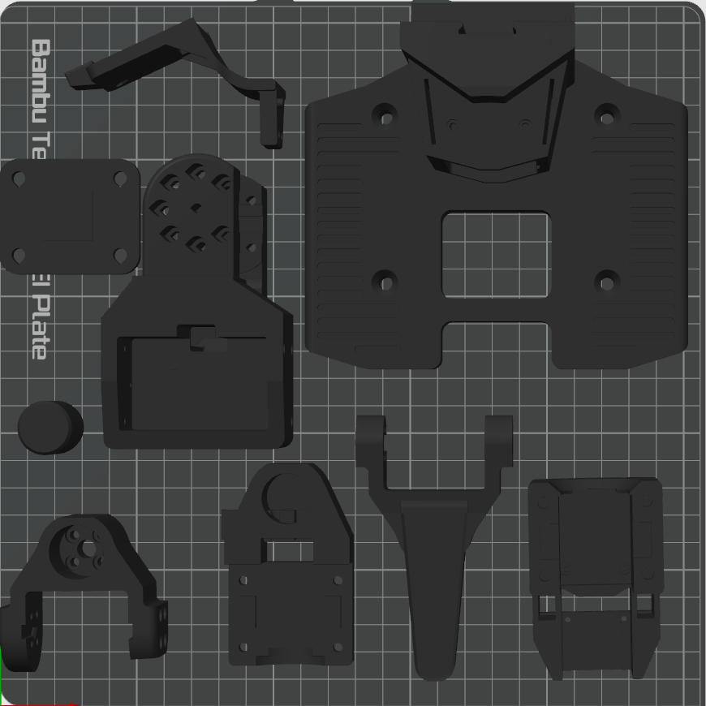
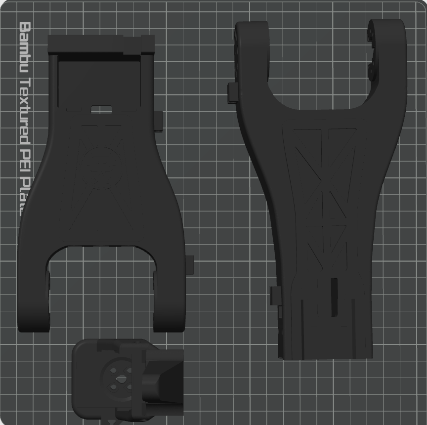
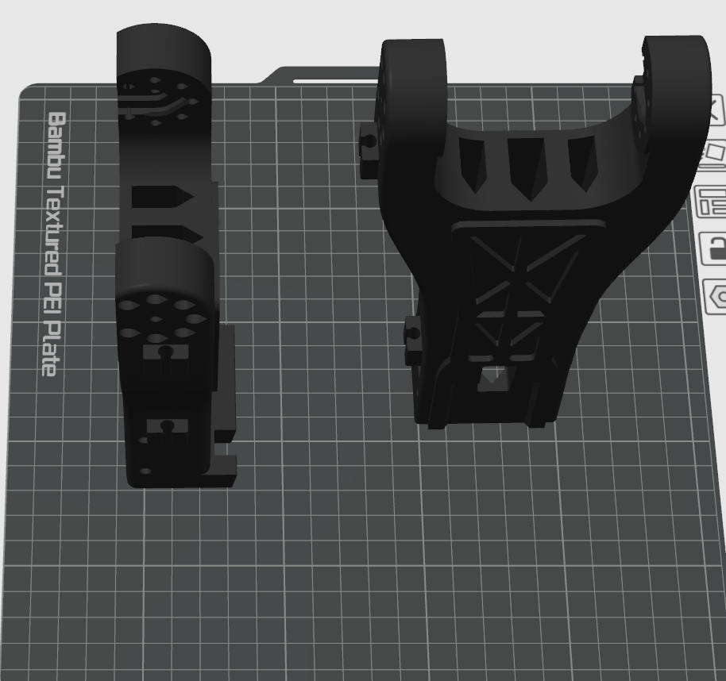

# 3D Printing Guide

All printable files for AM-ARM200 are provided in the `stl` directory. The parts are designed for common FDM printing and can be printed with PLA, PETG, or ABS.

## Recommended Printer

We recommend using a Bambu Lab P2S or a higher-end printer. Other well-tuned FDM printers can also be used, but the printed parts must be dimensionally accurate and mechanically strong enough for servo mounting and load-bearing joints.

## Material

Recommended materials:

- PLA: easy to print and suitable for general use.
- PETG: better toughness and heat resistance than PLA.
- ABS: suitable for higher temperature environments, but requires better chamber temperature control.

## Print Settings

| Part group | Walls | Infill |
|------------|------:|-------:|
| Follower arm parts | 4-6 walls | 15%-20% |
| Leader arm parts | 2 walls | 15%-20% |

For the follower arm, 4 walls are barely sufficient; 6 walls are strongly recommended.

Use normal layer heights and print speeds recommended by your slicer for the selected material. Make sure all screw holes and heat-set insert holes remain clean and dimensionally accurate.

## Print Orientation

Most parts can be printed in the default orientation shown in the STL files.

For the shoulder and elbow parts, horizontal printing provides better layer direction for strength, but the large contact area may lead to heat-related deformation, especially with materials that require higher bed or chamber temperatures.

If the shoulder or elbow parts warp during horizontal printing, print them vertically instead. Vertical orientation can significantly improve print success rate by reducing the heated footprint on the build plate, but it may reduce strength in some load directions because the layer lines are oriented differently. Use vertical printing as a practical fallback when horizontal printing is unstable.

After printing, remove supports carefully and check that all mating surfaces, servo pockets, and screw holes are clean before assembly.
